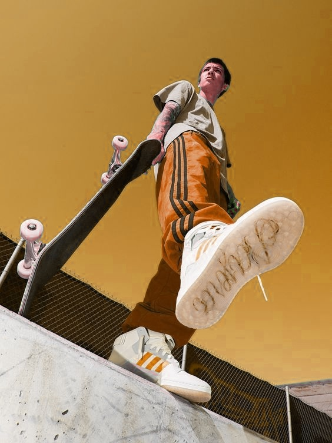

# Color Transform Hue

Color transform hue dilakukan untuk mentransformasi warna dari satu gambar ke gambar lainnya menggunakan metode manipulasi warna di ruang warna HSV (Hue, Saturation, Value). transformasi tersebut dilakukan mengikuti Langkah berikut.

## Langkah Langkah transform hue

### Membaca dan Mengonversi Gambar
Gambar sumber dan target dibaca dari file lokal, kemudian dikonversi dari ruang warna BGR ke HSV. Hal ini penting karena transformasi warna dilakukan pada saluran Hue, yang lebih intuitif di ruang HSV.

### Memisahkan Saluran HSV
Setelah konversi, setiap gambar dipecah menjadi tiga saluran:
- Hue (warna dasar)
- Saturation (intensitas warna)
- Value (kecerahan).

### Menghitung Statistik Warna
Rata-rata (mean) dan deviasi standar (standard deviation) dihitung untuk saluran Hue dari gambar sumber dan target.
- Mean menggambarkan nilai warna rata-rata.
- Standard deviation menggambarkan sebaran atau variasi warna.

### Transformasi Saluran Hue
- Nilai Hue target disesuaikan dengan mengurangi -rata-rata Hue target, sehingga menjadi nol relatif terhadap sumber.
- Variasi warna target disesuaikan dengan skala deviasi standar warna sumber.
- Setelah itu, nilai Hue sumber ditambahkan untuk mencocokkan karakteristik warna sumber.
- Nilai Hue yang dihasilkan dibatasi (clipped) dalam rentang valid [0, 360].

### Rekonstruksi Gambar
Setelah transformasi saluran Hue, saluran Saturation dan Value target digabungkan kembali dengan saluran Hue yang telah dimodifikasi. Gambar ini kemudian dikonversi kembali ke ruang warna BGR untuk dapat ditampilkan dan disimpan.

### Visualisasi dan Penyimpanan Hasil
Hasil transformasi ditampilkan di layar untuk dibandingkan dengan gambar asli. Kemudian, gambar hasil transformasi disimpan dalam file result.jpg.

## source kode
Beberapa baris source kode yang saya ingin bahas

```python
def image_resize(image, width=-1, height=-1):
    shape = image.shape
    if width == -1:
        if height == -1:
            return image
        else:
            return cv2.resize(image, (int(height * shape[1] / shape[0]), height))
    elif height == -1:
        return cv2.resize(image, (width, int(width * shape[0] / shape[1])))
    else:
        cv2.resize(image, (width, height))
```
image resize digunakan untuk mengubah ukuran gambar secara proporsional berdasarkan width atau height.

```python
originalS = cv2.imread("orange.jpeg")
originalT = cv2.imread("download (1).jpg")

source = cv2.cvtColor(originalS, cv2.COLOR_BGR2HSV).astype("float32")
target = cv2.cvtColor(originalT, cv2.COLOR_BGR2HSV).astype("float32")

cv2.imshow('original source', originalS)
cv2.imshow('original target', originalT)
```
Membaca gambar dengan OpenCV, mengubah gambar dari BGR ke HSV dan dikonversi ke tipe data float32, lalu menampilkan sumber dan target secara original

## Hasil

### menampilkan original source dan target beserta result 


### hasil file result.jpg


